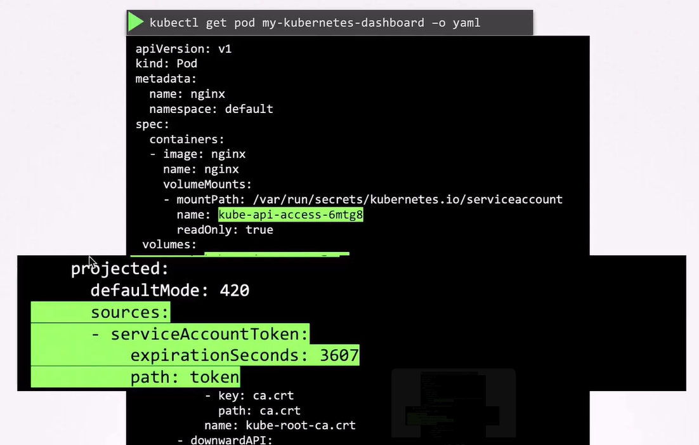
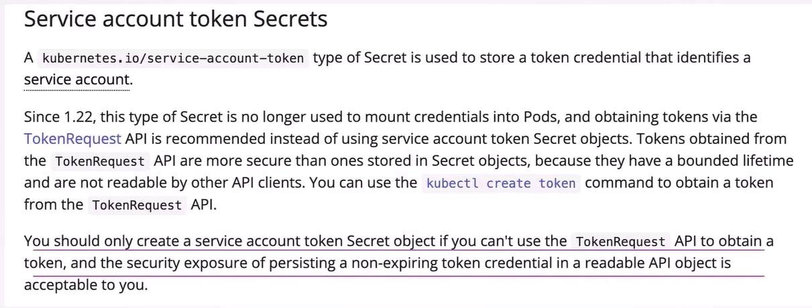

Certified Kubernetes Security Specialist (CKS)
------
1 - Course introduction:
AI, openAi is running in k8s

security is essentials - protect operations data
hands on labs
CKS exam objectives

Certified Kubernetes Security Specialist:
- K8s attack surface
- hardening k8s cluster
- securing the k8s dashbaord
- securing the underlying system
- setting up firewalls
- techniques to reduce vulnerabilities
- managing k8s secrets
- importance of securing supply chain
- runtime security

Tools:
AppArmor

Run time security:
Falco

2 - Exam information:
- hands-on exam
- refer kubernetes documentation

3 - Understanding the k8s attach surface - 4 lessons
3.1 - The Attack

know url only vote.com, result.com

find ip using ping command
ping vote.com, ping result.com

perform port-scan on the ip

zsh port-scan.sh <ip>
zsh port-scan.sh 104.21.63.124

# find the docker container using host
docker -H www.vote.com ps

docker -H www.vote.com version

# run privileged container in the host
docker -H www.vote.com run --priviledged -it ubuntu bash

# 3.2 - The 4C's of cloud native security
https://kubernetes.io/docs/concepts/security/
- Cloud
- Cluster Security
- Container
- Code refers application code

# 3.3 A quick remember
complete course and prepare your infra later, stay focused
focus on the labs

# 3.4 kodekcloud notes
https://notes.kodekloud.com/docs/Certified-Kubernetes-Security-Specialist-CKS/Introduction/Course-Introduction

# 4 - Cluster Setup and Hardening
# 4.1 Section introduction
- CIS Benchmarks
- Authentication
- Authorization
- Service Accounts
- TLS in Kubernetes
- Protect node metadata and endpoint
- Securing the Kubernetes Dashboard
- Verifying platform binaries
- upgrade kubernetes frequently
- network policies
- securing ingress

# 4.2 CIS bench markes
security benchmark:

CIS - Center for internet security benchmarks

over 25 vendors

# 4.3 Lab - Run CIS Benchmarks assessment tool on ubuntu

We have installed the CIS-CAT Pro Assessor tool called Assessor-CLI, under /root.

Please run the assessment with the Assessor-CLI.sh script inside Assessor directory and generate a report called index.html in the output directory /var/www/html/.Once done, the report can be viewed using the Assessment Report tab located above the terminal.

Run the test in interactive mode and use below settings:

Benchmarks/Data-Stream Collections: : CIS Ubuntu Linux 20.04 LTS Benchmark v3.0.0

Profile : Level 1 - Server

cd /root/Assessor
sh ./Assessor-CLI.sh -i -rd /var/www/html/ -nts -rp index
Benchmarks/Data-Stream Collections: CIS Ubuntu Linux 20.04 LTS Benchmark v3.0.0

Profile: Level 1 - Server

If the new changes are not reflected on the Assessment Report tab, then reload the report page.

# 4.4 CIS benchmarks for kubernetes
https://www.cisecurity.org/cybersecurity-tools/cis-cat-pro/cis-benchmarks-supported-by-cis-cat-pro

# 4.5 Setting up basic authentication
Download the CIS benchmark PDF’s from the below link:

https://www.cisecurity.org/cis-benchmarks/#kubernetes

Go to the `Server Software` section and click on the `Virtualization`.

There you will see multiple items that fall into the virtualization category such as VMware, docker and kubernetes. Now, move on to the Kubernetes and expand it to see more options then download CIS Kubernetes Benchmark version 1.6.0.

Download the CIS CAT tool’ from the below link:

https://www.cisecurity.org/cybersecurity-tools/cis-cat-pro/cis-benchmarks-supported-by-cis-cat-pro/

Download the CIS CAT Lite tool from the below link:

https://learn.cisecurity.org/cis-cat-lite

# 4.6 ServiceAccounts
- Authencation
- Authorization
- RBAC

two types of accounts
- user
  - users can login
- service
  - tools like jenkins or prometheous

# create service account using below command
kubectl create serviceaccount dashboard-ca

# view service account using below command
kubectl get serviceaccount

when sa is created it creates token automatically, this token will be used to authenticate external app
then it creates secret and stores token

# view the token in the secret
kubectl describe secret dashboard-sa-token-kbbdm

# test the token
curl https://<kubernetes-api> -insecure --header "Authorization: Bearer <<token>>"

# we can mount the secret as a volume to use for 3rd party app

# every namespace in the k8s will have default secret
# whenever pod is created default secret, sa automatically mounted to the pod

# view the mounted token
kubectl describe po my-kubernetes-dashboard

kubectl exec -it my-kubernetes-dashboard -- ls /var/run/secrets/kubernetes.io/serviceaccount

kubectl exec -it my-kubernetes-dashboard cat /var/run/secrets/kubernetes.io/serviceaccount/token

we can view the token in JWT site
v1.22 TokenRequestAPI is introducted

1.24: reduction of secrt-based sercice account tokens
- service account no longer creates secret

kubectl create serviceaccount dashboard-sa

- create token if we need for serviceaccount

kubectl create token dashboard-sa

# if we print and decode the token then it will have a expiry date
jq -R 'split(".") | select(length > 0) | .[0],.[1] | @base64d | fromjson <<< generatedToken >>>

https://kubernetes.io/docs/concepts/configuration/secret/#service-account-token-secrets

KEP 1205 - Bound service account tokens
https://github.com/kubernetes/enhancements/tree/master/keps/sig-auth/1205-bound-service-account-tokens

KEP-2799 - Reduction of Secret-based Service Account Tokens
https://github.com/kubernetes/enhancements/tree/master/keps/sig-auth/2799-reduction-of-secret-based-service-account-token

https://kubernetes.io/docs/concepts/configuration/secret/#service-account-token-secrets
https://kubernetes.io/docs/reference/access-authn-authz/service-accounts-admin/

# 4.7 kube-bench - not loading

# 4.8 Lab - Kube bench
Install kube bench in /root directory

version : v0.4.0

Download file: kube-bench_0.4.0_linux_amd64.tar.gz

NOTE: The link to the file can be found at the top right of the lab.

Solutiion:
curl -L https://github.com/aquasecurity/kube-bench/releases/download/v0.4.0/kube-bench_0.4.0_linux_amd64.tar.gz -o kube-bench_0.4.0_linux_amd64.tar.gz
tar -xvf kube-bench_0.4.0_linux_amd64.tar.gz

task2:
run kube-bench now and see the reults
Run a kube-bench test now and see the results

Run below command to run kube bench
./kube-bench --config-dir `pwd`/cfg --config `pwd`/cfg/config.yaml

task3:
fix 1.3.1 Edit the Controller Manager pod specification file /etc/kubernetes/manifests/kube-controller-manager.yaml
on the master node and set the --terminated-pod-gc-threshold to an appropriate threshold,
for example:
--terminated-pod-gc-threshold=10

task4:
Fix this failed test 1.3.6 Ensure that the RotateKubeletServerCertificate argument is set to true

Follow exact commands given in Remediation of given test
1.3.6 Edit the Controller Manager pod specification file /etc/kubernetes/manifests/kube-controller-manager.yaml
on the master node and set the --feature-gates parameter to include RotateKubeletServerCertificate=true.
--feature-gates=RotateKubeletServerCertificate=true

task5:
1.4.1 Edit the Scheduler pod specification file /etc/kubernetes/manifests/kube-scheduler.yaml file
on the master node and set the below parameter.
--profiling=false

***************
# Security primitives

- control api-server
  - who can access?
    - authentication:
      - files - username and passowords
      - username and tokens
      - certificates
      - external authenticaton providers - LDAP
      - Service Accounts
  - What can they do?
    - Authorization
      - RBAC Authorization
      - ABAC Authoriztion
      - node authorization
      - webhook mode
- TLS implementation
- network policies

# Authentication:
- Admins
- Developers
- Bots

Auth Mechanisms
- Static Password file - user-details.cvs - password,user,id
- Static Token file
- Certificates
- Identity Services

