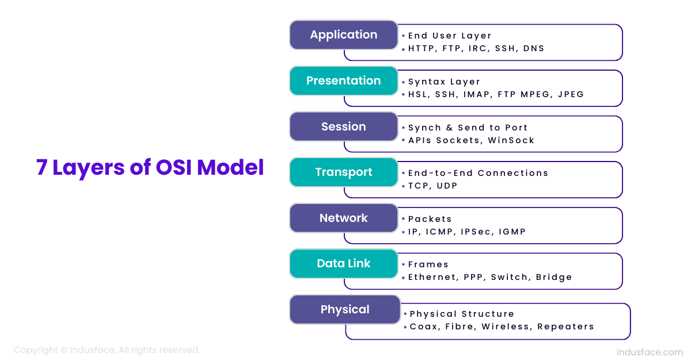

## Linux Capabilities

Processes on a Unix-like system run primarily with the permissions of either a user account, or with root permissions

#Check processes
ps aux

This approach of root user having unlimited priviledge and a normal user having limited privilege is not a good enough model.
User john wants to start the process that requires certain priviledged access, most organizations will grant John full access using sudo

Linux Capabilities are used to allow binaries(executed by non-root users) to perform priviledged operations without providing them all root permissions.
It also allows process started with root to have limited privilege.

Example - Ping
The ping command uses raw sockets to send and receive ICMP packets.
Allowing any user to create arbitrary network packets could be a security risk

instead of giving ping full root access, ping is given only the cap_net_raw capability, which is the minimum required to send and receive ICMP packets.

# which ping
# getcap /usr/bin/ping

# remove capabilities
setcap -r /usr/bin/ping

# add capability back to user
setcap cap_net_raw=ep /usr/bin/ping

# check the capabilities
getcap /usr/bin/ping

# Check the capabilities associated with a perticular process
ps aux -> get the proc no
5181
cat /proc/5181/status --> check for effective capabilities (CapEff) --> which is not human readble
capsh --decode=00011ffff

## Practical - Linux capabilities
Simple use-case
We have a program that binds to port 900.
In Linux, the port 1-1023 require root privileges
Aim is to allow non-privileged user to also run the program.

Sol: The CAP_NET_BIND_SERVICE capability in Linux allows a process to bind to privileged network ports(those below 1024) without requiring root privileges.
We will assocaite this program to process

## Security context
challenge: Many times, the containers run with root user privileges.
In case of container breakouts, an attacker can get full access to the host system.

## Privileged POD
Privileged containers are given all Linux capabilities, including capabilities that they don't require.
In most cases, you should avoid using privileged containers, and instead grant the specific capabilities required by your container using the capabilities field in the securityContext field

## Set capabilities for containers
By default, Kubernetes runs containers with a restricted set of capabilities.
If your application requires additional privileges(e.g. binding to privileged ports, modifying network settings), you must explicitly grant them.

only add the capabilities your application actually needs.
use drop:["ALL"] FIRST: then explicitly add only required capatbilities

## OVerview of admission controllers
Admission controllers that allow you to intercept, validate, and potentially modify requests to the Kubernetes API server before they are persisted as objects in etcd

2 types of admission controllers
validating - These can only allow or deny requests based on custom rules.
Mutating - These can modify requests before they are processed, in addition to allowing or denying them.

Example 1: NamespaceAutoProvision
By default, if you attempt to create resources in a nonexistent namespace, you will immediately encounter an error.

The NameSpaceAutoProvision admission controller inspects all incoming requests for namespaced resources and checks whether the referenced namespace exists.

if the namespace does not exist, the controller automatically creates it.

Example 2: PodSecurity
The PodSecurity Admission Controller enforces Pod Security Standards.
By enforcing Pod Security Standards, it ensures that pods deployed in your cluster comply with defined security best practices.

## ImagePullPolicy
When you create a Pod in kubernetes, the kubelet component interacts with the runtime(docker, containerd) to pull the container image from registry.

The ImagePullPolicy tells Kubernetes when to pull an image from a registry

Available ImagePullPolicy Settings
Always - Pulls the latest image from container registry
IfNotPresent - Pulls the image only if it is not already present on the node.
Never - Never pull the image. Instead, it assumes the image is already available on the node.

## Admission Controllers - Always pull image policy
Challenge:
If a sensitive container image is downloaded to a worker node using valid credentials, an unauthorized person can later create a new Pod using that same image with imagePullPolicy set to 'Never'. bypassing the need for authentication credentials.

This admission controller modifies every new Pod to force the image pull policy to Always.
This is useful in a multitenant cluster so that users can be assured that their private images can only be used by those who have the credentials to pull them.

without this admission controller, once an image has been pulled to a node, any pod from any user can use it by knowing the image's name

## Overview of Pod Security Standards:

In production environment, It is often seen that users launch privileged pods in production namespaces even when they are not required

Example - Security Standard Set
The security team has defined the following standards for the production namespaces

Security Standards:
- Containers must run as non-root users.
- HostPath volumes must be forbidden.
- Secomp profile must not be set to Unconfined.
- AppArmor profile is applied by default.
- No privileged containers.

This is more of an advisory, and enforcement is not 100% achieved.

In an ideal approach, you want any attempt to circumvent the security standards set by the security team to be blocked automatically.

Pod Security Standards are a set of guidelines established by Kubernetes to ensure that pods running in a namespace meet specific security requirements.

Policies in Pod Security Standard

The Pod Security Standards define three different policies.

These policies range from highly-permissive to highly-restrive.

Policies:
- Privileged - Unrestricted policy, providing the widest possible level of permissions. Allows privilege escalations
- Baseline - Minimally restrictive policy which prevents known privilege escalations
- Restricted - heavily restricted policy, following current pod hardening best practices.

The Restricted policy is aimed at enforcing current pod hardening best practices, at the expense of some compatibility

Target at operators and developers of security-critical applications, as well as lower-trust users
Examples:
- Everything from Baseline Policy +
- Containers must be required to run as on-root users.
- Containers must not set runAsUser to 0
- Seccomp profile must be explicitly set to one of the allowed values.

# Pod Security Admission
The Pod Security Admission(PSA) controller is a built-in admission controller in Kubernetes that enforces the Pod Security Standards(PSS)

When a Pod is created, PSA checks if it complies with the security policies set at the namespace level.

https://kubernetes.io/docs/concepts/security/pod-security-admission/

## Practical - Pod security standards
Overall Workflow
- We will create 3 namespaces for each policy level as part of PSP.

https://github.com/zealvora/certified-kubernetes-security-specialist/blob/main/domain-3-minimize-microservice-vulnerability/pss.md

## Modes = Pod security admission
Revising the basics

We usually add a label on a namespace to define the appropriate pod security standard profile.
Label format:

pod-security.kubernetes.io/<MODE>:<profile>

Modes:
enforce : rejects pods with policy violations
Audit : Allows pods with policy viloations but includes an audit annotation in the audit log event record.
Warn: Allows Pods with policy violations but warns users.

Multiple Modes can be used:
- A namespace can configure any or all modes, or even set a different level for different modes.

https://github.com/zealvora/certified-kubernetes-security-specialist/blob/main/domain-3-minimize-microservice-vulnerability/pss-modes.md

## pods to node PDA and PSS
pod security standards
pod security admimission controllers

for each mode, tehre are two labels that determine the policy used.

kubernetes introduces different versions of security policies(e.g v1.24, v1.25, etc) and the mode version indicates which set of security rules are applied

If we do not define the version in the pod security standard label, kubernetes will use the default version of the pod security admission(PSA) policy that is supported by the cluster.

The default version is typically the latest stable version supported by the Kubernetes API in that release.

If later, when Kubernetes is upgraded, the Pod security Standards may change in newer versions. This could lead to unexpected policy enforcement changes that might break workloads.
https://github.com/zealvora/certified-kubernetes-security-specialist/blob/main/domain-3-minimize-microservice-vulnerability/pss-notes.md

The enforce mode does not apply to workload objects like Deployments etc. Instead, enforcement happens only when the actual pods are created

Example:
A workload object(like a Deployment) can be created even if it's pod template violates security policies
But when kubernetes tries to create pods from that deployment, those pods will be blocked if they violate the enforced security policies

runtime classes

## Admission Controller - ImagePolicyWebHook
https://github.com/zealvora/certified-kubernetes-security-specialist/blob/main/domain-3-minimize-microservice-vulnerability/imagewebhook.md

## Revising Kubernetes Secrets:
HardCoding Secrets should be avoided:
It is frequently observed that sensitive data like passwords, tokens,etc, are hard-coded as part of the container image.

## Practical Kubernetes Secrets

## Overview of Cilium

unlike traditional CNI plugins which primarily rely on iptables and IP routing, Cilium uses eBPF to achive efficient packet processing, reducing complexity

Cilium network policy provides more granualarity, flexibility and advanced features than the standard Kubernetes network policy

Hubble is Cilium's observability layer, offering deep insights into your kubernetes cluster's network
It's like a powerful microscope for your cluster's network traffic, allowing you to see and understand what's happening at a granular level.

hubble observe --pod busybox -f

hubble observe

transpoarent encryption

## Configuring Cilium for Kubernetes

## Structure of Cilium network policies

the base structure CiliumnetworkPolicy is similar to a traditional network policies in kubernetes
https://github.com/zealvora/certified-kubernetes-security-specialist/blob/main/domain-3-minimize-microservice-vulnerability/cilium-netpol.md

## Cilium Network policies - Layer 3 Rules

## Cilium Network Policies - Entities based
Cilium provides predefined entities like world, host, cluster, and remote-node to define network policies

## Cilium Tranparent encryption

