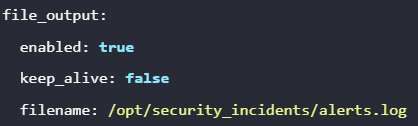

#### Exam 1
Question1:
```
A pod has been created in the **omni** namespace. However, there are a couple of issues with it.

The pod has been created with more permissions than it needs.
It allows read access in the directory **/usr/share/nginx/html/internal** causing an **Internal Site** to be accessed publicly.

To check this, click on the button called **Site** (above the terminal) and add **/internal/** to the end of the URL.
Use the below recommendations to fix this.

Use the AppArmor profile created at **/etc/apparmor.d/frontend** to restrict the internal site.
There are several service accounts created in the **omni** namespace. Apply the principle of least privilege and use the service account with the minimum privileges (excluding the **default** service account).
Once the pod is recreated with the correct service account, delete the other unused service accounts in **omni** namespace (excluding the **default** service account).

You can recreate the pod but do not create a new service accounts and do not use the default service account.
```
Solution:
```
On the controlplane node, load the AppArmor profile:
apparmor_parser -q /etc/apparmor.d/frontend
The profile name used by this file is restricted-frontend (open the /etc/apparmor.d/frontend file to check).


To verify that the profile was successfully loaded, use the aa-status command:

root@controlplane:~# aa-status | grep restricted-frontend
   restricted-frontend
root@controlplane:~#
The pod should only use the service account called frontend-default as it has the least privileges of all the service accounts in the omni namespace (excluding default)
The other service accounts, fe and frontend have additional permissions (check the roles and rolebindings associated with these accounts)

Use the below YAML File to re-create the frontend-site pod:
<br>


Next, Delete the unused service accounts in the 'omni' namespace.

controlplane$ kubectl -n omni delete sa frontend
controlplane$ kubectl -n omni delete sa fe

```
Question 2:
```
A pod has been created in the orion namespace. It uses secrets as environment variables. Extract the decoded secret for the **CONNECTOR_PASSWORD** and place it under **/root/CKS/secrets/CONNECTOR_PASSWORD.**

You are not done, instead of using secrets as an environment variable, mount the secret as a read-only volume at path **/mnt/connector/password** that can be then used by the application inside.
```
Solution:
```
To extract the secret, run: kubectl -n orion get secrets a-safe-secret -o jsonpath='{.data.CONNECTOR_PASSWORD}' | base64 --decode >/root/CKS/secrets/CONNECTOR_PASSWORD
One way that is more secure to distribute secrets is to mount it as a read-only volume.

Use the following YAML file to recreate the POD with secret mounted as a volume: <br>


```
Question 3:
```
A number of pods have been created in the **delta** namespace. Using the **trivy** tool, which has been installed on the controlplane, identify and delete pods **except** the one with least number of **CRITICAL** level vulnerabilities.

Note: Do not modify the objects in anyway other than deleting the ones that have critical vulnerabilities.
```
Solution:
```
First, get all the images of pods running in the delta namespace:

**kubectl -n delta get pods -o json | jq -r '.items[].spec.containers[].image'**
Next, scan each image using trivy image command. For example:

**trivy image --severity CRITICAL kodekloud/webapp-delayed-start**
Don't delete the associated pod which image has a least number of CRITICAL vulnerabilities as compared to others.

For example, if kodekloud/webapp-delayed-start, httpd and nginx:1.16 have these vulnerabilities:

**kubectl -n delta delete pod simple-webapp-1**
**kubectl -n delta delete pod simple-webapp-3**
**kubectl -n delta delete pod simple-webapp-4**
Ignore pods which use images of lower severity such as HIGH, MEDIUM, LOW e.t.c
```
Question 4:
```
Create a new pod called **audit-nginx** in the default namespace using the nginx image. Secure the syscalls that this pod can use by using the **audit.json** seccomp profile in the **pod's** security context.

The audit.json is provided at /root/CKS directory. Make sure to move it under the profiles directory inside the default seccomp directory before creating the pod
```
Solution:
```
Copy the audit.json seccomp profile to /var/lib/kubelet/seccomp/profiles on the controlplane node:

controlplane$ mv /root/CKS/audit.json /var/lib/kubelet/seccomp/profiles
Next, recreate the pod using the below YAML File
<br>

```
Question 5:
```
The CIS Benchmark report for the **Controller Manager** and **Scheduler** is available at the tab called **CIS Report 1.**

Inspect this report and fix the issues reported as FAIL
```
Solution:
```
The fixes are mentioned in the same report. Update the Controller Manager and Scheduler static pod definition file as per the recommendations.
1. Make sure that the --profiling=false parameter is set.
```
Question 6:
```
There is something suspicious happening with one of the pods running an httpd image in this cluster.
The Falco service shows frequent alerts that start with: File below a known binary directory opened for writing.

Identify the rule causing this alert and update it as per the below requirements:

Output should be displayed as: CRITICAL File below a known binary directory opened for writing (user_id=user_id file_updated=file_name command=command_that_was_run)
Alerts are logged to /opt/security_incidents/alerts.log

Do not update the default rules file directly. Rather use the falco_rules.local.yaml file to override.
Note: Once the alert has been updated, you may have to wait for up to a minute for the alerts to be written to the new log location.
```
Solution:
```
Enable file_output in /etc/falco/falco.yaml on the controlplane node: <br>

 <br>
Next, add the updated rule under the /etc/falco/falco_rules.local.yaml and hot reload the Falco service: <br>


```
Question 7:
```
A pod called busy-rx100 has been created in the production namespace. Secure the pod by recreating it using the runtimeClass called gvisor. You may delete and recreate the pod.
```
Solution:
```

```
Question 8:
```
We need to make sure that when pods are created in this cluster, they cannot use the latest image tag, irrespective of the repository being used.

To achieve this, a simple Admission Webhook Server has been developed and deployed. A service called image-bouncer-webhook is exposed in the cluster internally. This Webhook server ensures that the developers of the team cannot use the latest image tag. Make use of the following specs to integrate it with the cluster using an ImagePolicyWebhook:

Create a new admission configuration file at /etc/admission-controllers/admission-configuration.yaml
The kubeconfig file with the credentials to connect to the webhook server is located at /root/CKS/ImagePolicy/admission-kubeconfig.yaml. Note: The directory /root/CKS/ImagePolicy/ has already been mounted on the kube-apiserver at path /etc/admission-controllers so use this path to store the admission configuration.
Make sure that if the latest tag is used, the request must be rejected at all times.
Enable the Admission Controller.

Finally, delete the existing pod in the magnum namespace that is in violation of the policy and recreate it, ensuring the same image but using the tag 1.27.

NOTE: If the kube-apiserver becomes unresponsive, this can affect the validation of this exam. In such a case, please restore the kube-apiserver using the backup file created at: /root/backup/kube-apiserver.yaml, wait for the API to be available again and proceed.
```
Solution:
```

 <br>

The /root/CKS/ImagePolicy is mounted at the path /etc/admission-controllers directory in the kube-apiserver. So, you can directly place the files under /root/CKS/ImagePolicy.

Here is a snippet of the volume and volumeMounts (already added to apiserver config): <br>


Next, update the kube-apiserver command flags and add ImagePolicyWebhook to the enable-admission-plugins flag. Use the configuration file that was created in the previous step as the value of admission-control-config-file.

Note: Remember, this command will be run inside the kube-apiserver container, so the path must be /etc/admission-controllers/admission-configuration.yaml (mounted from /root/CKS/ImagePolicy in controlplane).

   **- --admission-control-config-file=/etc/admission-controllers/admission-configuration.yaml
    - --enable-admission-plugins=NodeRestriction,ImagePolicyWebhook**

In case we mess up while solving the question, API server could become unresponsive.

For example:

The connection to the server controlplane:6443 was refused - did you specify the

In such case scenario restore kube-apiserver to it's default state using the backup provided at /root/backup/kube-apiserver.yaml

Run the below command to restore the kube-apiserver initial state:

cp -v /root/backup/kube-apiserver.yaml /etc/kubernetes/manifests
```